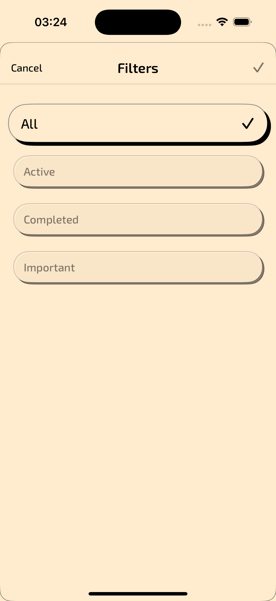

# To-Do Swift UI App

## Description
Simple To-Do app developed using SwiftUI. It was originally developed for Android. You can find the Android repository [here](https://github.com/berkanturkali/todo-android). However, as significant time has passed since the Android version's development and I have made some changes to the backend, the Android version requires refactoring.

## Technologies & Libraries

+ Swift UI: Used for building the user interface.
+ MVVM Architecture: Used to structure the app and improve code organization.
+ Localizable.strings: Used for supporting multiple languages.
+ Custom Fonts: Included to enhance the app's design.

## Screenshots
|                                                       |                                                                                   |                                                                                         |
|:-----------------------------------------------------:|:---------------------------------------------------------------------------------:|:---------------------------------------------------------------------------------------:|
|  |  |  |

|                                                       |                                                                                   |                                                                                         |
|:-----------------------------------------------------:|:---------------------------------------------------------------------------------:|:---------------------------------------------------------------------------------------:|
|  |  |  |

|                                                       |                                                                                   |                                                                                         |
|:-----------------------------------------------------:|:---------------------------------------------------------------------------------:|:---------------------------------------------------------------------------------------:|
|  |  |  |

